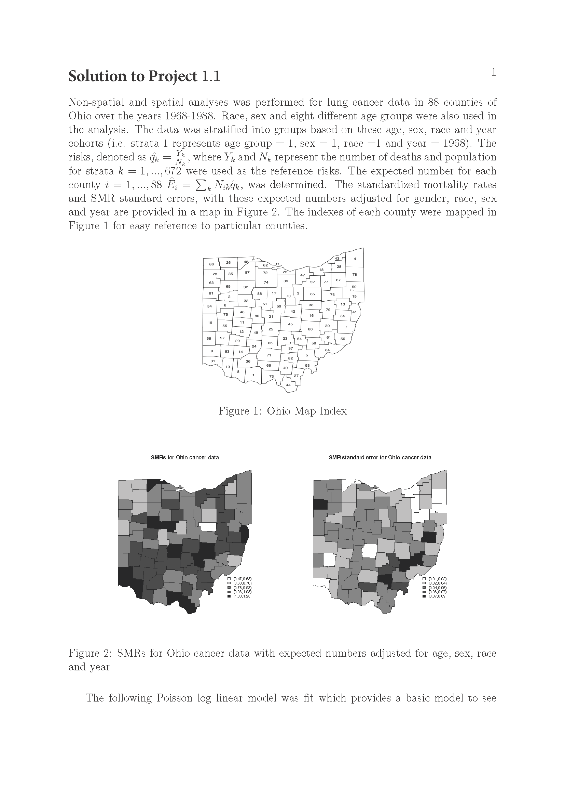
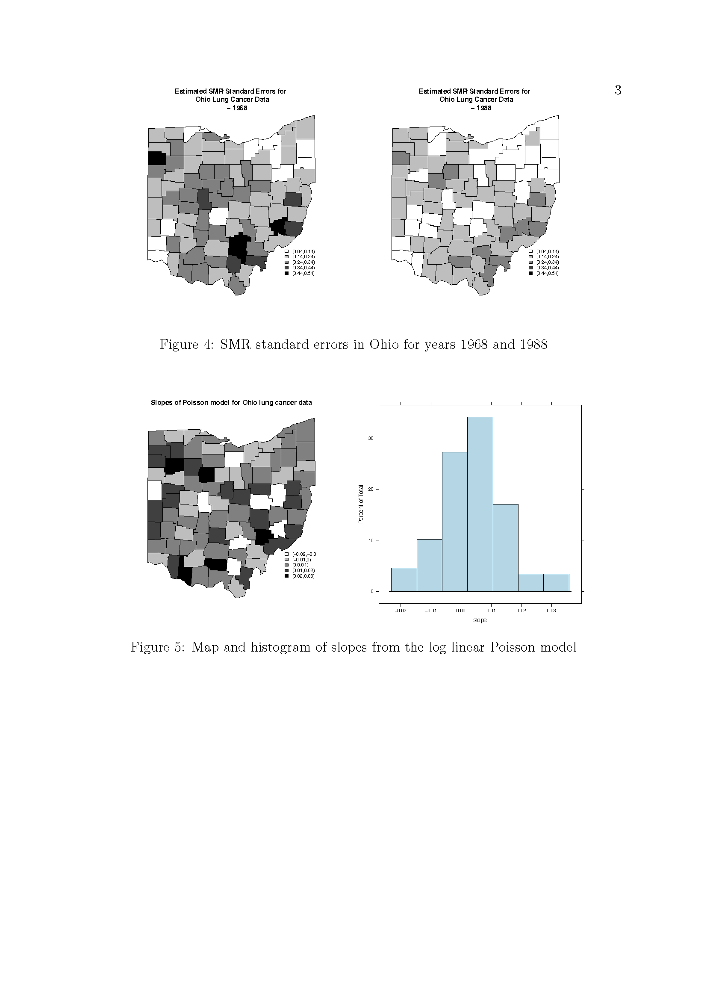
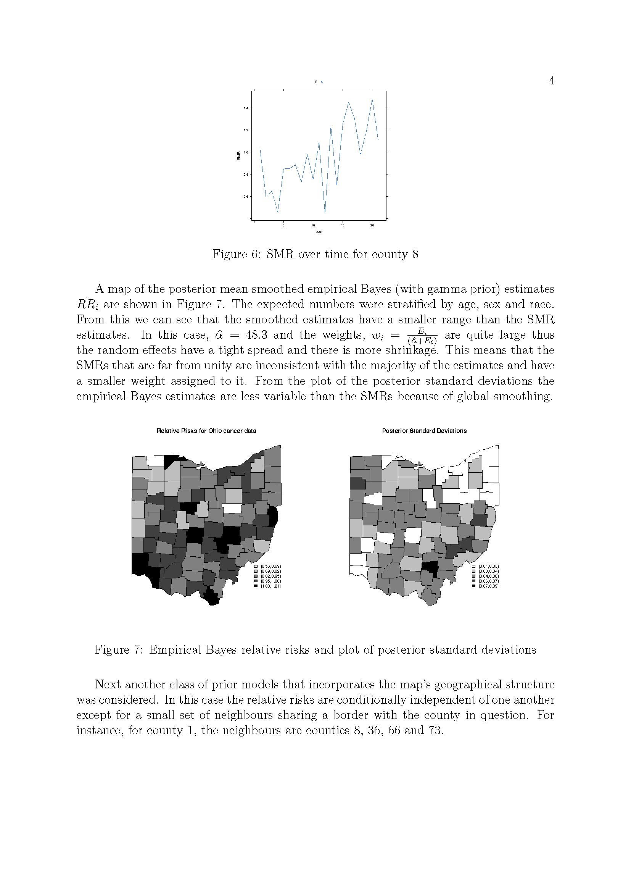
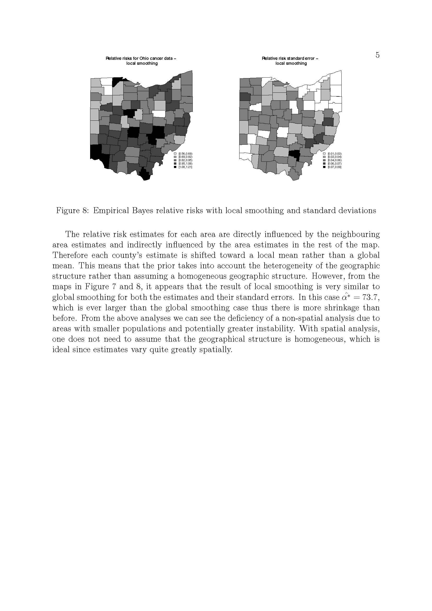

# (PART\*) First set of projects

# Project1_1

## Introduction

 For this exercise you should perform an analysis of  the spatial distribution of lung cancer in Ohio between 1968-1988.  For each county in Ohio the number of lung cancer deaths and people at risk are given conditioned on county, year, sex, age category and race.

You are to perform both non-spatial and spatial analyses of the data and to compare the results between the different approaches. You should consider the best of dealing with data over multiple years. You should pay special consideration to how the results are most meaningfully presented, both in terms of visual representation and in choosing appropriate methods of summarizing risk.  

## The Problem

The following is a list of pointers to consider:

1. You should clearly state a non-spatial model that is suitable for this analysis and fit it in R. You should describe clearly the results and present them in an informative way. Explain any potential deficiencies in adopting this approach. 

2. Explain why a spatial smoothing approach might be more applicable in this case. Define clearly how an empirical Bayes approach which might be used in this case, explaining clearly what it adds to the analyses.

3. Fit your spatial model using R and present the resulting smoothed relative risks in a meaningful way. 

4. Investigate the effects of the negative binomial dispersion parameter on the smoothed risks you obtain. 

5. Consider alternative outputs which might be useful, in addition to relative risks, and write a report of your findings collating the information gained from all of your analyses.

The OhioMap function on the course webpage can be used as a basis for presenting the results of your analyses. 

## Solution to Project 1.1
{width=120%}
{width=120%}
{width=120%}
{width=120%}
{width=120%}

