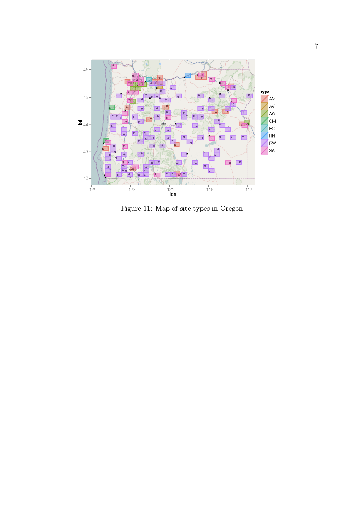

# Project1_2

## Introduction

 This exercise is about visualization, important for spatial statistics. R provides a variety of options for plotting data on maps. 
%An individual has described a selection of these in the project folder called ``examples''. 
A vignette can also be found for one of these at
http://cran.r-project.org/web/packages/plotGoogleMaps/
vignettes/plotGoogleMaps-intro.pdf
for one of these packages.  
The data for this part of the exercise were produced by the MURI group at the U of Washington (www.probcast.washington.edu) and provide amongst other things temperature (degrees Kelvin) for a large number of sites in the Pacific NW (with spatial coordinates).  Consider the one labelled  ``phase1.temp.txt'', that gives (for GMT) temperatures (in the "obs" column) for the period January 12, 2000 to June 30, 2000. The data are incomplete since not all sites collect data on the same day.  We will focus on Apr 1, 2000 and stations located in Oregon State. You can use Google Earth (setting spatial coordinates to be given in decimal form) to determine coordinates of sites that lie in Oregon. Those coordinates can also be used to construct a ``bounding box'' for Oregon.

## The Problem

1.Using a package of your choice, plot the points for sites active on Apr 1 on a map of Oregon.

2. Create a regular grid of spatial points that cover Oregon. Using a method of your choice, predict for Apr 1, values of temperature at the points of intersection in your lattice. 

3.  Construct a contour plot of temperature in Oregon on Apr 1, 2000.

4. Add any other informative features to your plot that you deem useful.

## Solution to Project 1.2

{width=120%}
{width=120%}